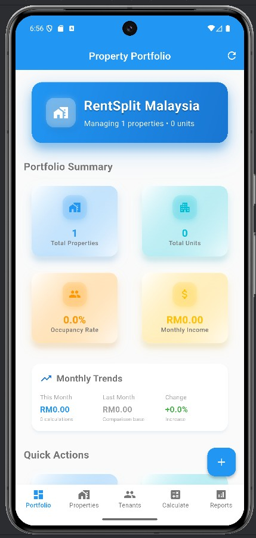
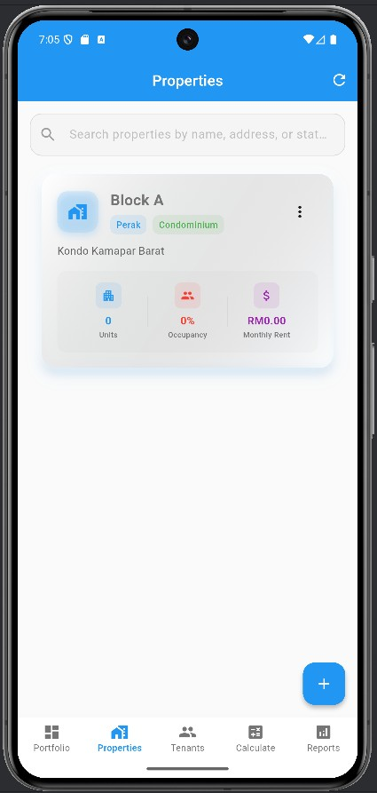
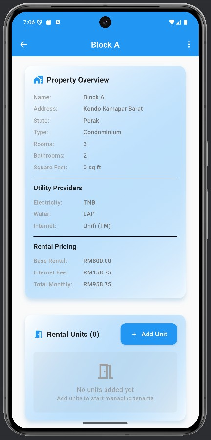
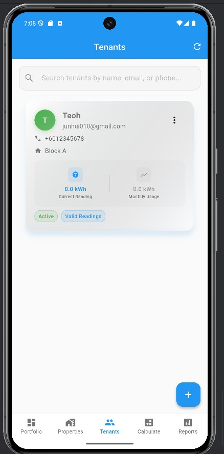
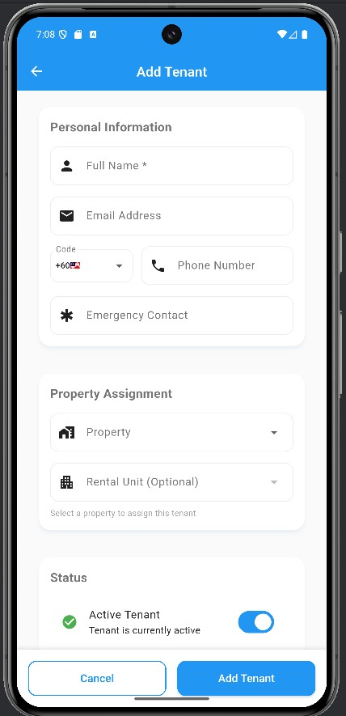
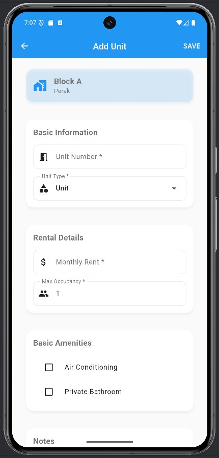
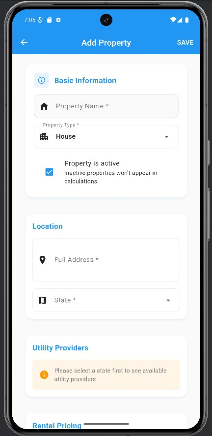
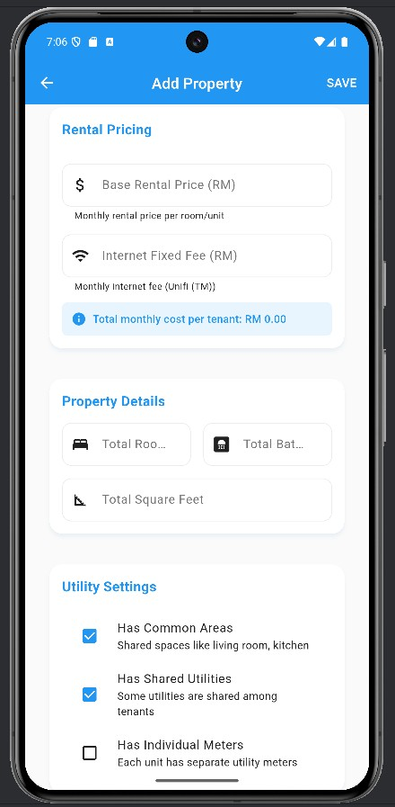
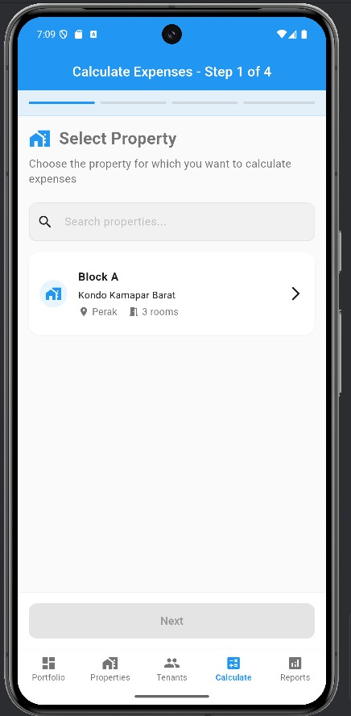
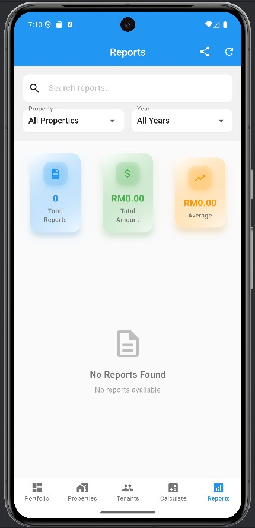

# RentSplit Malaysia 🏠💰

A Flutter application for **fair electricity bill distribution** among Malaysian property owners and tenants, with **TNB 2025 compliance**.

[](https://flutter.dev/)
[](https://dart.dev/)
[](LICENSE)

## 🎯 What This App Solves

**Problem**: Splitting electricity bills fairly among tenants in Malaysia is complex due to:
- TNB's new 2025 billing structure with multiple charges and taxes
- Individual air conditioning usage differences
- Common area electricity sharing
- Manual calculations prone to errors and disputes

**Solution**: RentSplit Malaysia automates TNB-compliant calculations with individual AC tracking for transparent, fair billing.

## ⚡ Core Features

### TNB 2025 Electricity Calculation
- **Complete TNB Compliance**: Energy charge, capacity charge, network charge, retail charge
- **Tax Calculations**: KWTBB (1.6%), SST (8%), Energy Efficiency Incentive
- **Individual AC Tracking**: Separate meters for each tenant's air conditioning usage
- **Common Area Distribution**: Fair allocation of shared electricity costs

### Two Calculation Methods
1. **Simple Average Method** - Easy to understand, best when usage differences are small (≤20 kWh)
2. **Layered Precise Method** - Maximum fairness, best when usage varies significantly (>50 kWh)

### Simple Utility Management
- **Water Bills**: Fixed amount input, equal split among tenants
- **Internet/WiFi**: Fixed monthly cost, equal distribution
- **Other Costs**: Any shared expenses with equal splitting

### Professional Output
- **PDF Receipts**: Professional-looking individual tenant bills
- **WhatsApp Sharing**: Easy sharing of bills and calculations
- **Historical Tracking**: Complete calculation history and trends

## 📱 App Screenshots

### 🏠 Portfolio & Property Management


*Clean dashboard showing all your properties at a glance with modern light blue theme*


*Easy property management with quick access to all your rental units*


*Detailed property view with comprehensive information and management options*

### 👥 Tenant Management


*Complete tenant overview with individual details and billing history*


*Simple tenant registration form with all necessary information fields*

### 🏢 Unit Management


*Easy unit creation with customizable settings and tenant assignment*

### 💰 Expense & Calculation Management


*Step 1: Property registration with basic information and location details*


*Step 2: Advanced property settings and utility configuration*


*TNB 2025 calculation wizard with step-by-step guidance for accurate bill splitting*

### 📊 Reports & Analytics


*Comprehensive reporting dashboard with detailed analytics and historical data*

---

## 🚀 Quick Start

### Prerequisites
- Flutter SDK 3.32.0+
- Dart SDK 3.5.0+
- Android Studio or VS Code with Flutter extensions

### Installation
```bash
# Clone the repository
git clone https://github.com/yourusername/RentSplit.git
cd RentSplit

# Install dependencies
flutter pub get

# Run the application
flutter run
```

### Build for Release
```bash
# Android APK
flutter build apk --release

# iOS (macOS only)
flutter build ios --release

# Web
flutter build web --release
```

## 💡 How It Works

### Monthly Calculation Process (5 minutes)
```
1. Select Property & Month
   ↓
2. Input TNB Bill (Amount + Total kWh)
   ↓
3. Record Individual AC Meter Readings
   ↓
4. Add Fixed Costs (Water, Internet)
   ↓
5. Choose Calculation Method
   ↓
6. Generate & Share Individual Bills
```

### Example Calculation
**Scenario**: 3 tenants, TNB bill RM 278.40 (680 kWh total)

**AC Readings**:
- Tenant A: 120 kWh
- Tenant B: 100 kWh  
- Tenant C: 80 kWh
- Common area: 380 kWh

**Simple Average Method**:
```
Average rate: RM 278.40 ÷ 680 = RM 0.4094/kWh
Common per person: 380 ÷ 3 = 127 kWh

Tenant A: (120 + 127) × 0.4094 = RM 101.12
Tenant B: (100 + 127) × 0.4094 = RM 92.93
Tenant C: (80 + 127) × 0.4094 = RM 84.75

Plus water (RM 15.20 each) + internet (RM 29.67 each)
```

## 🏗️ Architecture

### Technology Stack
- **Framework**: Flutter 3.32.0
- **Language**: Dart 3.5.0
- **Database**: SQLite with comprehensive schema
- **State Management**: Provider pattern
- **UI**: Material Design 3 with modern light blue theme
- **Design**: Professional Malaysian property management interface

### Project Structure
```
lib/
├── main.dart                 # App entry point
├── models/                   # Data models (Property, Tenant, etc.)
├── services/                 # Business logic (TNB calculations, etc.)
├── screens/                  # UI screens
├── widgets/                  # Reusable components
├── database/                 # SQLite database management
└── providers/                # State management
```

## 📚 Documentation

### For Users
- [**Core Features**](docs/CORE_FEATURES.md) - Main functionality overview
- [**TNB Electricity Guide**](docs/TNB_ELECTRICITY_GUIDE.md) - Understanding TNB 2025 system
- [**Calculation Methods**](docs/CALCULATION_METHODS.md) - Simple vs Layered approaches
- [**User Cases**](docs/USER_CASES.md) - Real-world scenarios

### For Developers
- [**Setup Guide**](docs/SETUP_GUIDE.md) - Development environment setup
- [**Program Structure**](docs/PROGRAM_STRUCTURE.md) - Code architecture
- [**Database Design**](docs/DATABASE_DESIGN.md) - Data structure and relationships
- [**API Documentation**](docs/API_INTEGRATIONS.md) - Internal services

## 🎯 Target Users

### Property Owners/Landlords
- Manage multiple properties with transparent billing
- Reduce time from 2 hours to 5 minutes for monthly calculations
- Eliminate tenant disputes with professional receipts

### Property Managers
- Handle multiple client properties efficiently
- Generate professional reports for property owners
- Ensure compliance with Malaysian regulations

### Tenants
- Understand exactly how utility costs are calculated
- Trust in fair distribution of electricity costs
- Receive digital receipts for record-keeping

## 🌟 Why Choose RentSplit Malaysia?

### Malaysian-Specific
- **TNB 2025 Compliance**: Only app with complete new billing structure
- **Local Providers**: Support for TNB, SESB (Sabah), SEB (Sarawak)
- **Malaysian Currency**: All calculations in Ringgit Malaysia (RM)

### Fair & Transparent
- **Individual AC Tracking**: Pay only for your actual usage
- **Two Calculation Methods**: Choose what works best for your situation
- **Professional Receipts**: Clear breakdown of all costs

### Easy to Use
- **5-Minute Process**: Complete monthly calculations quickly
- **Modern UI Design**: Clean, light blue interface with Material Design 3
- **Mobile-First**: Designed for smartphones and tablets
- **Cross-Platform**: Works on Android, iOS, Web, and Desktop

## 🔮 Roadmap

### Current Version (v1.0.0)
- ✅ TNB 2025 electricity calculation engine
- ✅ Individual AC meter tracking
- ✅ Simple utility cost handling
- ✅ Modern light blue UI design
- ✅ Professional receipt generation
- ✅ Cross-platform compatibility

### Future Versions (v2.0+)
- 📋 Payment integration (FPX, Touch 'n Go)
- 📋 Advanced water provider calculations
- 📋 Multi-language support (Bahasa Malaysia)
- 📋 Cloud synchronization
- 📋 Mobile app store releases

## 🤝 Contributing

We welcome contributions! Please see our [Contributing Guidelines](CONTRIBUTING.md) for details.

### Development Setup
1. Fork the repository
2. Create a feature branch
3. Make your changes
4. Add tests if applicable
5. Submit a pull request

## 📄 License

This project is licensed under the MIT License - see the [LICENSE](LICENSE) file for details.

## 📞 Support

- **Documentation**: Check the [docs/](docs/) folder for comprehensive guides
- **Issues**: Report bugs or request features via GitHub Issues
- **Discussions**: Join community discussions in GitHub Discussions

## 🙏 Acknowledgments

- **TNB Malaysia**: For providing detailed billing structure information
- **Flutter Team**: For the excellent cross-platform framework
- **Malaysian Developer Community**: For feedback and testing

---

**Made with ❤️ for the Malaysian rental community**

*Simplifying utility bill splitting, one calculation at a time.*
